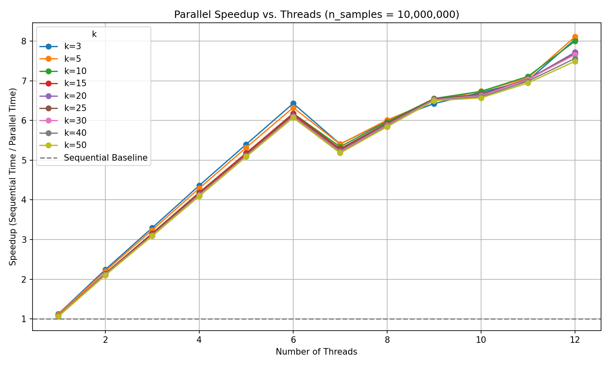

# Sequential vs. Parallel K-Means Implementation

[](https://opensource.org/licenses/MIT)
[](https://isocpp.org/)
[](https://cmake.org/)

This repository contains a C++ implementation of the K-Means clustering algorithm in both sequential and parallel (using OpenMP) versions. The project's main goal is to analyze and compare the performance and scalability of these two approaches under various conditions, such as dataset size, number of clusters, and thread count.

The findings demonstrate the trade-offs between sequential and parallel execution, highlighting when parallelization provides significant speedup and when its overhead makes it less efficient.

## Key Features

- **Sequential K-Means:** A standard, single-threaded implementation serving as a performance baseline.
- **Parallel K-Means:** A multi-threaded version using OpenMP to accelerate the most computationally intensive steps of the algorithm.
- **Synthetic Data Generation:** Includes functionality to generate synthetic datasets for testing.
- **Performance Benchmarking:** The executable is designed to measure and report execution time, making it easy to compare performance.
- **CMake Build System:** Provides a cross-platform, easy-to-use build process.

## Performance Highlight

The parallel implementation shows excellent scalability on large datasets. The plot below illustrates the speedup achieved on a dataset with 10 million points as the number of threads increases.



_Caption: Speedup vs. number of threads for n=10,000,000 with varying k. The tests were run on a Ryzen 5 3600 (6-core, 12-thread) CPU._

---

## Getting Started

### Prerequisites

To build and run this project, you will need:

- A C++ compiler that supports C++17 and OpenMP (e.g., GCC, Clang).
- [CMake](https://cmake.org/download/) (version 3.10 or higher).
- [Git](https://git-scm.com/).

### Installation and Build

1.  **Clone the repository:**

    ```sh
    git clone https://github.com/dvrkoo/Parallel.git
    cd Parallel/KMeans
    ```

2.  **Create a build directory:** It's best practice to build the project out-of-source.

    ```sh
    mkdir build
    cd build
    ```

3.  **Configure with CMake and build the project:**
    ```sh
    cmake ..
    make
    ```
    This will create an executable named `kmeans` in the `build` directory.

## Usage

The program is run from the command line with arguments specifying the dataset size, number of clusters, and number of threads.

### Command-Line Interface

```sh
./kmeans <num_points> <num_clusters> <num_threads> [--sequential]
```

- `<num_points>`: The number of data points to generate.
- `<num_clusters>`: The number of clusters ($k$) to find.
- `<num_threads>`: The number of threads to use for the parallel version.
- `[--sequential]`: (Optional) A flag to force the sequential execution. If omitted, the parallel version runs by default.

### Examples

- **Run the sequential version** with 1 million points and 20 clusters:
  ```sh
  ./kmeans 1000000 20 1 --sequential
  ```
- **Run the parallel version** with 10 million points, 50 clusters, and 12 threads:

```sh
./kmeans 10000000 50 12
```

The program will output the execution time to the console.

## Performance Analysis

The core of this project is the performance comparison between the sequential and parallel implementations. The results show a clear trade-off dictated by problem size.

### Key Observations

1.  **Large Datasets ($n \ge 10^6$):** The parallel version offers substantial speedup, scaling well with the number of threads up to the physical core count of the CPU. It is the clear choice for big data problems.

2.  **Small Datasets ($n < 1000$):** The overhead of thread management (creation, synchronization) outweighs the computational gains. In these cases, the sequential version is often faster.

3.  **Effect of Cluster Count ($k$):** A higher `k` increases the computational work per data point. This makes parallelization more effective, even on smaller datasets.

### Summary of Speedup Results

The table below contrasts the speedup for a high cluster count ($k=50$) on a small vs. a large dataset. It powerfully illustrates how problem scale determines parallel efficiency.

| Threads | Speedup (n=100) | Speedup (n=10,000,000) |
| :-----: | :-------------: | :--------------------: |
|    2    |      2.25x      |         2.10x          |
|    4    |      3.33x      |         4.10x          |
|    6    |      3.57x      |         6.07x          |
|    8    |      2.99x      |         5.84x          |
|   12    |      3.15x      |         7.49x          |
